# Run k8s cluster on local machine

## Overview
- This is my study project to run k8s cluster on my local machine.

## Specifications
- The project is made to run k8s cluster on local machine.

- The k8s cluster is running on fedora core os that is running on qemu.

- The k8s nodes are communicating with each other through wireguard vpn.

## Running Sequence
```sh
# Run ignition template server.
./ignition.sh

# Run wireguard vpn server on host machine.
## The wireguard vpn server is running on host machine with podman.
## The wireguard vpn server is used to connect k8s nodes.
./host_vpn_server.sh

# Initialize fedora core os on qemu.
./init_kube_vm_qemu.sh

## The fedora core os is running on qemu.
## The fedora core os is used to run k8s cluster.
## vmname is presented on before script.
./machines/vmname/start_vm.sh
```

## Roadmap
- ✅ Initialize wireguard vpn server on host machine.
    - The project uses podman to run wireguard vpn server.
- ✅ Initialize fedora core os on qemu.
- ✅ Connecting fedora core os to wireguard vpn.
- 🚧 Initialize k8s control plane.
- 🚧 Initialize k8s worker node.

## Infrastructure Graph

```mermaid
architecture-beta
    group local [local macihne]
    group podman [podman] in local

    service wireguard (internet) [wireguard] in podman

    group vm1 [vm1] in local
    group vm2 [vm2] in local
    group vm3 [vm3] in local

    service kubemain(logos:kubernetes)[K8S Control Plane] in vm1
    service kubeworker1(logos:kubernetes)[K8S Worker] in vm2
    service kubeworker2(logos:kubernetes)[K8S Worker] in vm3

    wireguard:L -- B:kubemain
    wireguard:B -- T:kubeworker1
    wireguard:R -- B:kubeworker2
```
